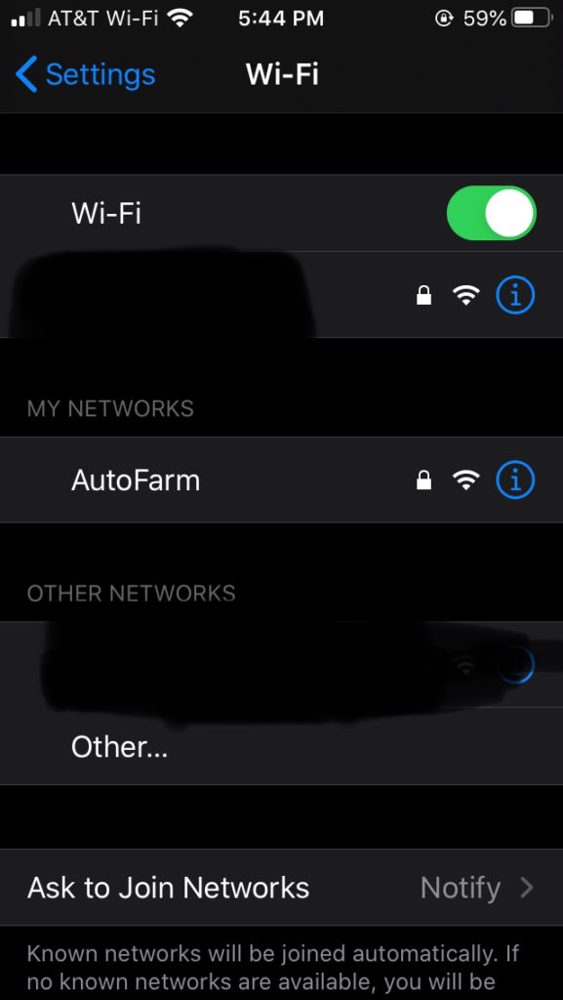
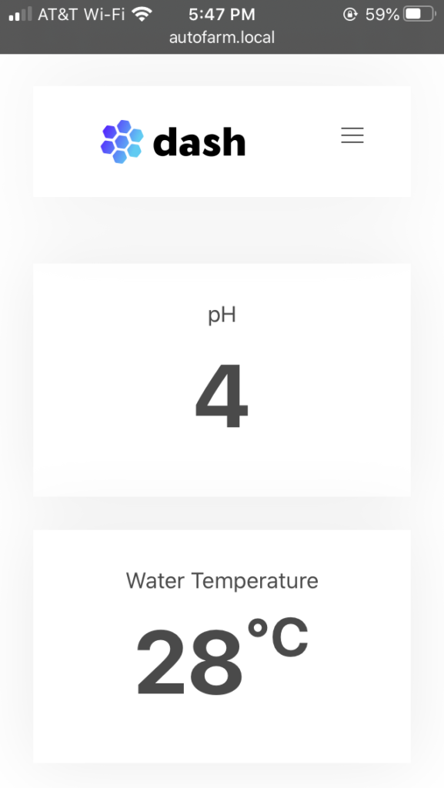

# The Automated Farmer :herb:

The Automated Farmer is an open source hydroponic monitoring solution. If you're interested in building your own, please visit the website [here](https://theautomatedfarmer.com).

## Required Libraries:

1. [ESP-DASH](https://github.com/ayushsharma82/ESP-DASH): Used to create the user-interface. A very simple library and very recommended!
2. [ESPAsyncWiFiManager](https://github.com/alanswx/ESPAsyncWiFiManager): Used to avoid hardcoding WiFi credentials. A huge assistance to internet security!

## Usage

First, download and install the Arduino libraries listed above. Simply upload the code to your ESP8266 and you'll be greeted with a WiFiManager configuration page:

The WiFiManager configuration page.

Then if you've hooked up sensors to the ESP, you'll see the values change in real-time:

The live data screenshot.
